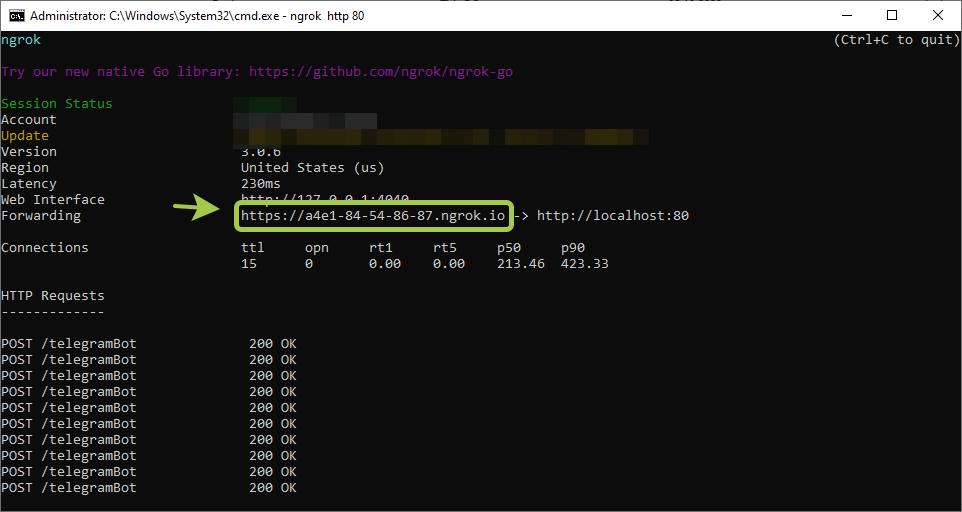
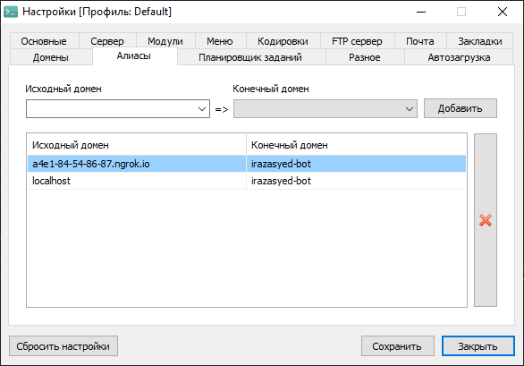

# Configurations

### ngrokni ishga tushiramiz

```
ngrok http 80
```
### ngrok bergan public urlni olamiz


### .env faylga yozamiz
```
TELEGRAM_BOT_TOKEN=YOUR_BOT_TOKEN
WEBHOOK_URL=YOUR_NGROK_URL

```
### Open serverni sozlash


<p> Open serverning "Алиасы" degan bo'limiga ngrokdan olgan public urlni localda turgan projectizmiga yo'naltiramiz.</p>

### Webhook qilish
```
http://localhost/webhook
```

### Webhook result 

```
{"ok":true,"result":true,"description":"Webhook is already set"}
```